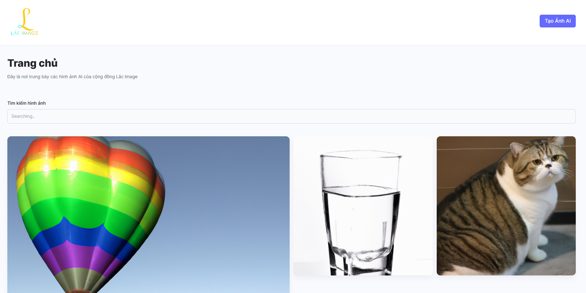

# Lắc Image - Ai Image Generator

## Introduction

Raw images are generated from user-supplied text descriptions using
the OpenAI API and the DALL-E model. The project also has a front-end interface
built with React, allowing users to easily create their own images.


<p>
 
</p>


## Tech Stack

**Client:** React JS, Vite JS, TailwindCSS, PostCSS

**Server:** Node JS, Express JS, MongooseJS, Cloudinary, Open AI


## Setup & Installation

- Create ENV File in Server folder

```bash
- ai-image-generator
  - server
    - node_modules
    - public
    - src
    - .env         <-- create it here
    - env.example  <-- this is the base file
    - .gitignore
    - package-lock.json
    - package.json
```

```env
// .env
MONGODB_URL= "Replace with your url"
OPEN_AI_KEY=  "Replace with your key"
CLOUDINARY_CLOUD_NAME= "Replace with yours"
CLOUDINARY_API_KEY= "Your api key"
CLOUDINARY_API_SECRET= "Your app secret key"
```


## Author(s)

Developed by xNinzy